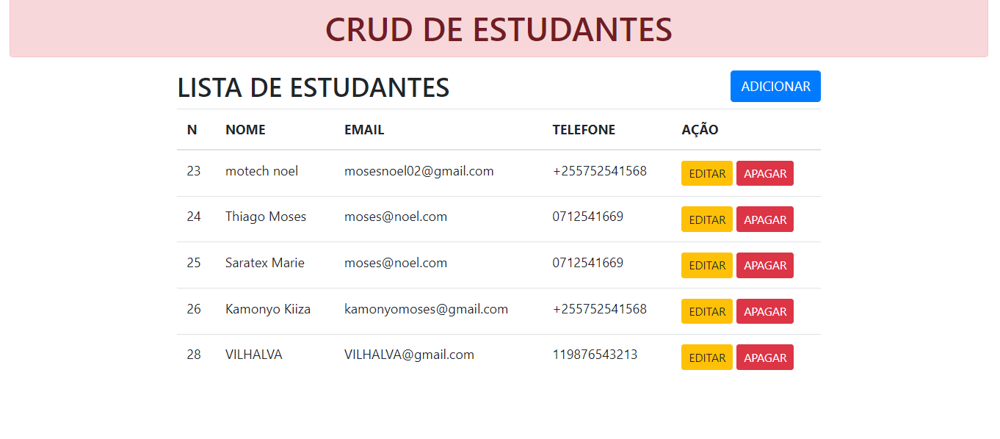
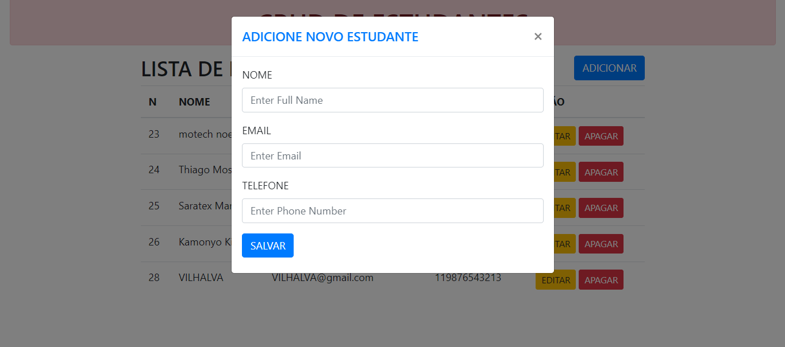
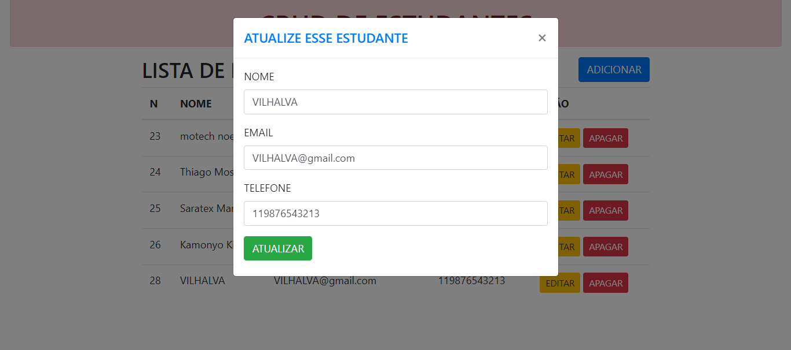
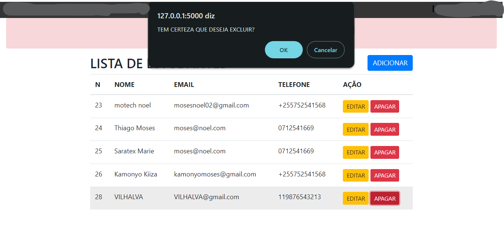
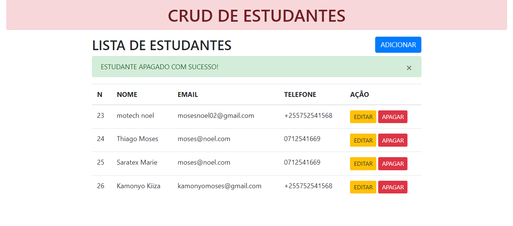

# CRUD DE ESTUDANTES
👨‍🏫CRUD DE ESTUDANTES COM FLASK E MYSQL!

 <br> 
 <br> 
 <br> 
 <br> 
 <br> 
 <br>

## DESCRIÇÃO:
Este aplicativo é um sistema CRUD (Create, Read, Update, Delete) desenvolvido em Flask, um framework web em Python, e utiliza o MySQL como banco de dados.

Com esta aplicação, você pode efetivamente gerenciar as informações essenciais dos estudantes:

1. **Nome:** Insira o nome completo do estudante neste campo.

2. **Email:** Forneça o endereço de e-mail do estudante aqui.

3. **Telefone:** Insira o número de telefone do estudante neste campo.

Esses dados são cruciais para manter registros precisos e atualizados de cada estudante. Com a capacidade de administrar esses aspectos fundamentais, é fácil manter um banco de dados detalhado sobre os estudantes cadastrados.

Este aplicativo oferece uma interface da web simples e intuitiva para adicionar, editar, excluir e visualizar registros dos estudantes no banco de dados MySQL. Ele proporciona uma maneira eficaz de gerenciar todas as informações relacionadas aos estudantes com facilidade e eficiência.

## EXECUTANDO O PROJETO:
1. **Configuração do Banco de Dados:**
   - Antes de executar o site, é necessário importar o arquivo `./DATABASE/DATABASE.sql` para criar a estrutura inicial do banco de dados.

2. **Configuração do MySQL:**
   - Abra o arquivo `app.py` localizado no diretório raiz do projeto e ajuste as configurações do banco de dados de acordo com suas credenciais:
     ```python
     app.config['MYSQL_HOST'] = 'localhost'  # Endereço do servidor MySQL
     app.config['MYSQL_USER'] = 'seu_usuario'  # Nome de usuário do MySQL
     app.config['MYSQL_PASSWORD'] = 'sua_senha'  # Senha do MySQL
     app.config['MYSQL_DB'] = 'crud'  # Nome do banco de dados
     ```
   Certifique-se de fornecer as credenciais corretas para que o aplicativo possa se conectar ao banco de dados MySQL corretamente.

3. **Instalando as dependências:**
   - Antes de executar o aplicativo, certifique-se de instalar todas as dependências necessárias. No terminal, execute o seguinte comando para instalar as dependências listadas no arquivo `requirements.txt` no diretório: `CODIGO`:
   ```bash
   pip install -r requirements.txt
   ```
   - Isso instruirá o pip a ler o arquivo requirements.txt e instalar todas as dependências listadas.

4. **Executando o Aplicativo:**
   - Em seguida, execute o seguinte comando para iniciar o servidor Flask:
   ```bash
   python app.py
   ```
   - Uma vez que o servidor esteja em execução, você poderá acessar o aplicativo através do seu navegador, visitando o seguinte endereço: `http://localhost:5000/`.
   
5. **Interagindo com o Aplicativo (Operações CRUD):**
   - **Create (Criar):** Clique no botão "ADICIONAR" para inserir um novo estudante. Preencha os campos necessários na janela modal e clique em "SALVAR".
   - **Read (Ler):** Você verá uma lista de estudantes cadastrados na página principal.
   - **Update (Atualizar):** Cada linha da lista terá botões para editar ou excluir o estudante correspondente. Clique em "EDITAR", faça as alterações necessárias na janela modal e clique em "ATUALIZAR".
   - **Delete (Excluir):** Ao clicar em "APAGAR", o estudante correspondente será removido do banco de dados após confirmação.

## TECNOLOGIAS USADAS:
- [**FLASK:**](https://github.com/VILHALVA/CURSO-DE-FLASK) Framework de aplicativo da web em Python.
- [**MYSQL:**](https://github.com/VILHALVA/CURSO-DE-MYSQL) Sistema de gerenciamento de banco de dados relacional.
- [**BOOTSTRAP:**](https://github.com/VILHALVA/CURSO-DE-BOOTSTRAP) Biblioteca de CSS para facilitar o desenvolvimento do layout e design responsivo da interface do usuário.

## CREDITOS:
- [PROJETO CRIADO PELO "MoTechStore"](https://github.com/MoTechStore/Python-Flask-MySQL-CRUD-App)
- [VEJA O VIDEO DESSE PROJETO](https://youtu.be/FkWyWZhMUjY?si=F5Bzn2wgJVqEorik)
- [PROJETO EDITADO PELO VILHALVA](https://github.com/VILHALVA)


